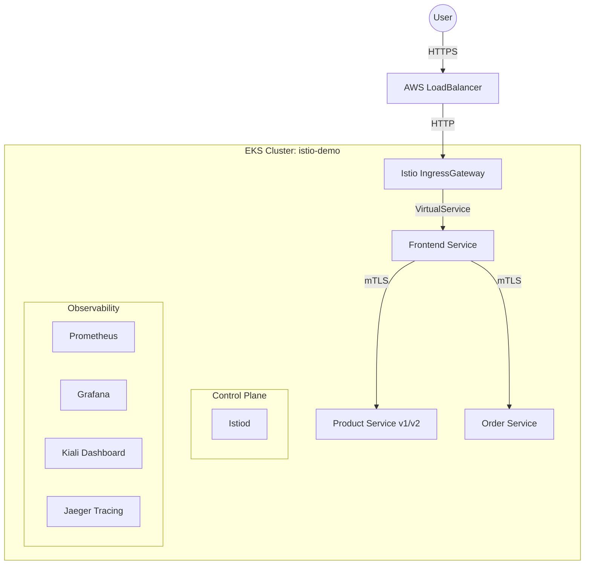

# Advanced Kubernetes Service Mesh with Istio

A production-grade implementation of a Service Mesh using Istio on AWS EKS, demonstrating Traffic Management, Security (mTLS), and Observability.

## 🏗 Architecture
The solution deploys a Shop Application consisting of three microservices (**Frontend**, **Product-Service**, **Order-Service**) into an EKS Cluster. Istio controls traffic flow (Canary releases) and secures communication (mTLS).



## 🚀 Prerequisites
- **AWS Credentials**: Export `AWS_ACCESS_KEY_ID`, `AWS_SECRET_ACCESS_KEY`, `AWS_REGION` (us-east-1 default).
- **Terraform** >= 1.0
- **Kubectl**
- **Docker** (to build images)
- **Helm** (for observability)

## 🛠 Quick Start (Codespaces)

1.  **Infrastructure Setup** (Approx. 15 mins)
    ```bash
    cd terraform
    terraform init
    terraform apply -auto-approve
    ```

2.  **Configure Access**
    ```bash
    aws eks update-kubeconfig --region us-east-1 --name istio-mesh-demo
    ```

3.  **Install Istio**
    ```bash
    chmod +x scripts/*.sh
    ./scripts/install_istio.sh
    ```

4.  **Deploy Application**
    *Note: You need to build images or use a public repo. Set `IMAGE_REPO` to your DockerHub username or ECR URI.*
    ```bash
    export IMAGE_REPO=your-dockerhub-username
    # Optional: Build images (requires docker login)
    # ./scripts/build_images.sh
    
    ./scripts/deploy_apps.sh
    ```

5.  **Configure Mesh & Observability**
    ```bash
    ./scripts/apply_istio_config.sh
    ./scripts/observability.sh
    ```

## 🚦 Traffic Management (Canary)
We have configured a **90/10 traffic split** for the `product-service`.
- 90% of requests go to `v1`
- 10% of requests go to `v2`

To verify:
```bash
# Get Gateway IP
IGW_IP=$(kubectl get svc istio-ingressgateway -n istio-system -o jsonpath='{.status.loadBalancer.ingress[0].hostname}')

# Loop curl
while true; do curl -s http://$IGW_IP/ | grep "Version"; sleep 0.5; done
```

## 🔒 Security
**Strict mTLS** is enabled for the `istio-demo` namespace using `PeerAuthentication`. All service-to-service traffic is encrypted.
Verify with:
```bash
istioctl authn tls-check frontend.istio-demo.svc.cluster.local
```

## 📊 Observability
Access dashboards (port-forward needed):
- **Kiali**: `istioctl dashboard kiali`
- **Grafana**: `kubectl port-forward svc/prometheus-grafana -n istio-system 3000:80` (Login: admin/prom-operator)
- **Jaeger**: `istioctl dashboard jaeger`

## 🧹 Cleanup
Destroy resources to avoid AWS costs:
```bash
cd terraform
terraform destroy -auto-approve
```
